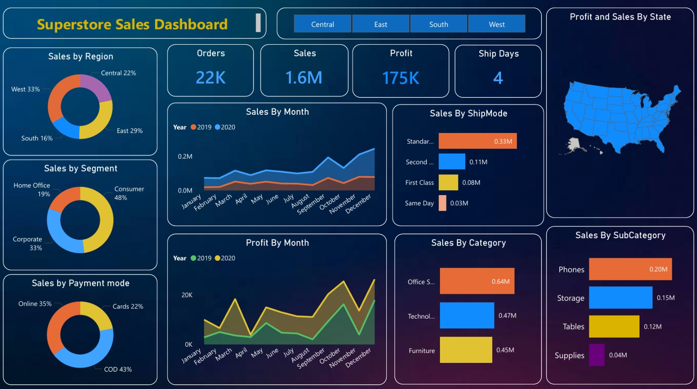

# 📊 Superstore Sales Dashboard

---
# 🚀 Project Overview
The Superstore Sales Dashboard is an interactive Power BI project built to analyze retail sales performance across different regions, customer segments, categories, and shipping methods.
This dashboard helps business managers identify profitable areas, monitor sales trends, and make data-driven decisions.
---
# 🎯 Project Objective
The objective of this project is to
- Analyze sales performance
- Compare yearly sales
- Monitor monthly sales trends
- Understand customer purchasing behavior
- Identify profitable product categories
- Improve business decision making
---
# 📁 Dataset
The dataset contains retail sales information including
- Order ID
- Order Date
- Ship Date
- Customer Segment
- Region
- State
- Category
- Sub Category
- Sales
- Profit
- Ship Mode
- Payment Mode
---
# 🛠 Tools Used
- Power BI Desktop
- Microsoft Excel / CSV
- Power Query
- DAX
- Data Modeling
---
# 📊 Dashboard KPIs
| KPI | Value |
|------|--------|
| Total Orders | 22K |
| Total Sales | 1.6M |
| Total Profit | 175K |
| Average Ship Days | 4 |
---
# 📈 Dashboard Features
## 1. Sales by Region
Shows contribution of
- Central
- East
- South
- West
Business Insight:
West region generates the highest sales.
---
## 2. Sales by Month
Compares
- 2019 Sales
- 2020 Sales
Business Insight:
Sales increased significantly during the last quarter.
---
## 3. Profit by Month
Displays monthly profit trend.
Business Insight:
Highest profit is observed during November and December.
---
## 4. Sales by Segment
Customer Segments
- Consumer
- Corporate
- Home Office
Business Insight:
Consumer segment contributes nearly half of total sales.
---
## 5. Sales by Payment Mode
Shows
- Online
- COD
- Cards
Business Insight:
Cash on Delivery is the most preferred payment method.
---
## 6. Sales by Ship Mode
Displays sales through
- Standard Class
- Second Class
- First Class
- Same Day
Business Insight:
Standard Class contributes the maximum sales.
---
## 7. Sales by Category
Categories
- Office Supplies
- Technology
- Furniture
Business Insight:
Office Supplies generate the highest sales.
---
## 8. Sales by Sub Category
Top selling products
- Phones
- Storage
- Tables
- Supplies
Business Insight:
Phones generate maximum sales.
---
## 9. Profit and Sales by State
Interactive USA Map showing
- Sales
- Profit
Business Insight:
Helps identify high-performing states.
---
# 📌 Key Business Insights
✔ West region is the best performing region.
✔ Consumer segment contributes highest revenue.
✔ Standard shipping is most frequently used.
✔ Phones are the top selling sub-category.
✔ Office Supplies generate highest category sales.
✔ Sales peak during November and December.
✔ COD is the most preferred payment mode.
✔ Total sales crossed **1.6 Million**.
---
# 💼 Skills Demonstrated
- Data Cleaning
- Power Query
- Data Modeling
- DAX
- KPI Design
- Dashboard Development
- Business Intelligence
- Data Visualization
---
# 📬 Connect with Me
**Ravindra Kolekar**

🔗 LinkedIn
https://www.linkedin.com/in/ravindra-kolekar-24817b2b6/

📧 Email
kolekarravindra17@gmail.com
